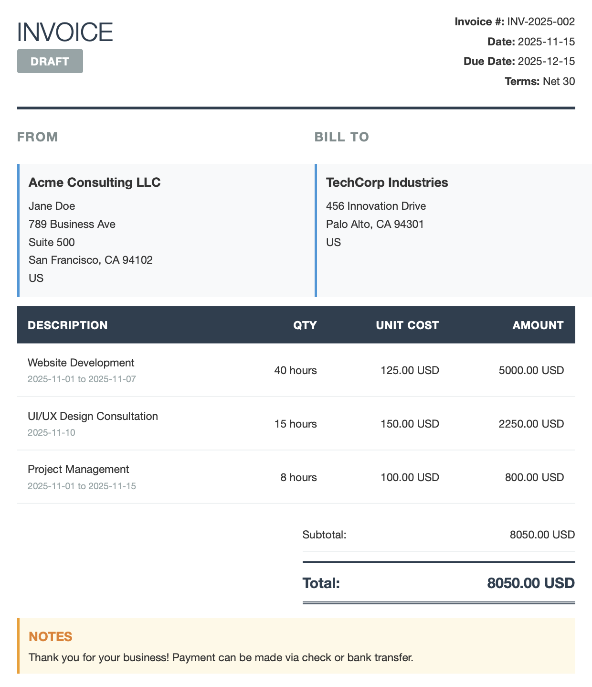

# Invoice Generator

Generate professional HTML and PDF invoices from YAML data.



## Installation

```bash
python3 -m venv venv
source venv/bin/activate
pip install --upgrade pip
pip install -r requirements.txt
```

## Usage

### Generate Invoice

You can put the source files anywhere, but I recommend placing them in a `data/` folder.

```bash
# e.g. invoice yaml location: data/my_invoice.yaml
python generate_invoice.py data/my_invoice.yaml
```

This will create:
- `output/{invoice-id}.html` - HTML preview
- `output/{invoice-id}.pdf` - PDF invoice

### Validate Invoice YAML

```bash
python validate_invoice.py data/my_invoice.yaml
```

## YAML Structure

### Required Fields

```yaml
invoice:
  invoice_id: INV-2025-001
  date: 2025-11-01
  due_date: 2025-11-30
  currency: USD
  payment_terms: "Net 30"

  sender:
    name: Your Name
    organization: Your Company
    address:
      street: 123 Main St
      optional: Suite 100
      city: Austin
      state: TX
      zip: 78701
      country: US

  bill_to:
    organization: Client Company
    address:
      street: 456 Client St
      city: Austin
      state: TX
      zip: 78702
      country: US

  items:
    - description: Consulting Services
      units: hours
      quantity: 10
      unit_cost: 150.00
      date: 2025-11-01
```

### Optional Fields

```yaml
invoice:
  status: final  # draft, final, paid, overdue, whatever you like
  notes: "Payment due upon receipt"
```

### Date Ranges

Items can have either a single date or a date range:

```yaml
# Single date
- description: One-day service
  date: 2025-11-01

# Date range
- description: Multi-day service
  date:
    start: 2025-11-01
    end: 2025-11-05
```

### Attachments

Items can have multiple attachments:

```yaml
- description: Design Work
  units: hours
  quantity: 8
  unit_cost: 100.00
  date: 2025-11-01
  attachments:
    - "data/design_mockup_v1.png"
    - "data/design_mockup_v2.png"
    - "data/final_design.png"
```

Attachments will be displayed in a 3-column grid on page 2 of the PDF.

## Features

- Clean, professional invoice design
- Automatic calculation of totals
- Support for single dates or date ranges
- Multiple attachments per line item
- Attachments displayed on separate page
- YAML validation with helpful error messages
- PDF generation for printing/sending
- Beautiful CLI with colors, spinners, and progress indicators